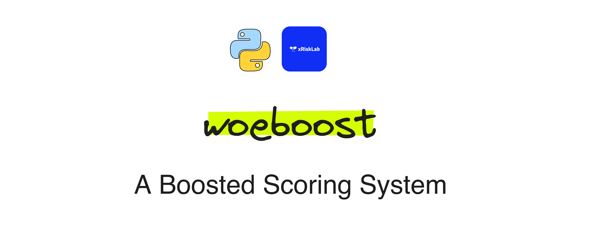

# WoeBoost
**Author:** [xRiskLab](https://github.com/xRiskLab)<br>
**Version:** v0.1.0<br>
**License:** [MIT License](https://opensource.org/licenses/MIT) (2024)



**WoeBoost** is a Python 🐍 package designed to bridge the gap between the predictive power of gradient boosting and the interpretability required in high-stakes domains such as finance, healthcare, and law. It introduces an interpretable, evidence-driven framework for scoring, inspired by the principles of **Weight of Evidence (WOE)** and the ideas of **Alan M. Turing**.

## 🔑 Key Features

- **🌟 Gradient Boosting with Explainability**: Combines the strength of gradient boosting with the interpretability of WOE-based scoring systems.
- **📊 Calibrated Scores**: Produces well-calibrated scores essential for decision-making in regulated environments.
- **🤖 AutoML-like Enhancements**:
  - Infers monotonic relationships automatically (`infer_monotonicity`).
  - Supports early stopping for efficient training (`enable_early_stopping`).
- **🔧 Support for Missing Values & Categorical Inputs**: Handles various data types seamlessly while maintaining interpretability.
- **🛠️ Diagnostic Toolkit**:
  - Partial dependence plots.
  - Feature importance analysis.
  - Decision boundary visualization.
- **📈 WOE Inference Maker**: Provides classical WOE calculations and bin-level insights.

## ⚙️ How It Works

1. **🔍 Initialization**: Starts with prior log odds, representing baseline probabilities.
2. **📈 Iterative Updates**: Each boosting iteration calculates residual per each binned feature and sums residuals into total evidence (WOE), updating predictions.
3. **🔗 Evidence Accumulation**: Combines evidence from all iterations, producing a cumulative and interpretable scoring model.

## 🧐 Why WoeBoost?

- **💡 Interpretability**: Every model step adheres to principles familiar to risk managers and data scientists, ensuring transparency and trust.
- **✅ Alignment with Regulatory Requirements**: Calibrated and interpretable results meet the demands of high-stakes applications.
- **⚡ Flexibility**: Works seamlessly with diverse data types and supports customizations for complex datasets, including multi-threading for CPU.

## Installation ⤵

Install the package using pip:

```bash
pip install woeboost
```

## 💻 Example Usage

Below we provide two examples of using WoeBoost.

### Training and Inference with WoeBoost classifier

```python
from woeboost import WoeBoostClassifier

# Initialize the classifier
woe_model = WoeBoostClassifier(infer_monotonicity=True)

# Fit the model
woe_model.fit(X_train, y_train)

# Predict probabilities and scores
probas = woe_model.predict_proba(X_test)[:, 1]
preds = woe_model.predict(X_test)
scores = woe_model.predict_score(X_test)
```

### Preparation of WOE inputs for logistic regression

```python
from woeboost import WoeBoostClassifier

# Initialize the classifier
woe_model = WoeBoostClassifier(infer_monotonicity=True)

# Fit the model
woe_model.fit(X_train, y_train)

X_woe_train = woe_model.transform(X_train)
X_woe_test = woe_model.transform(X_test)
```

## 📚 Documentation

- **[Technical Note](./docs/technical_note.md)**: Overview of the WoeBoost modules.
- **[`learner.py`](./docs/learner.md)**: Core module implementing a base learner.
- **[`classifier.py`](./docs/classifier.md)**: Module for building a boosted classification model.
- **[`explainer.py`](./docs/explainer.md)**: Module for explaining the model predictions.

## 📄 License
This project is licensed under the MIT License - see the [LICENSE](LICENSE.md) file for details.

## 📃 Change Log

- **v0.1.0**
  - Initial release of WoeBoost.
