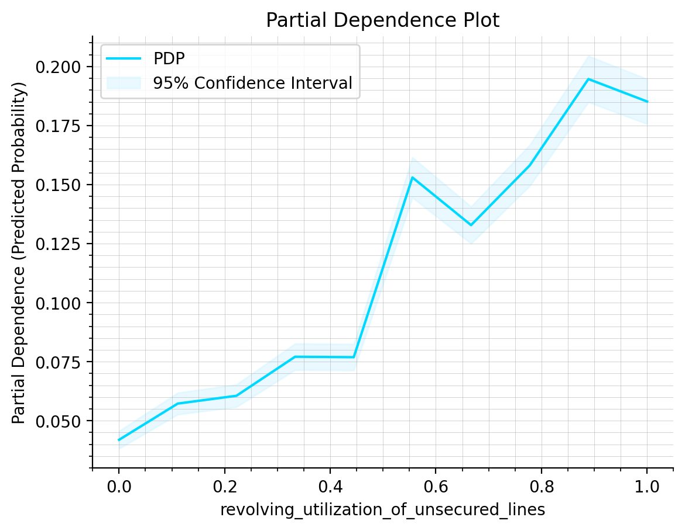
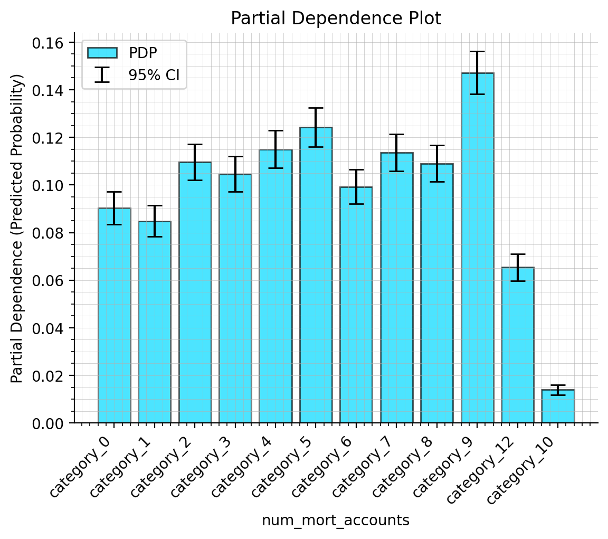
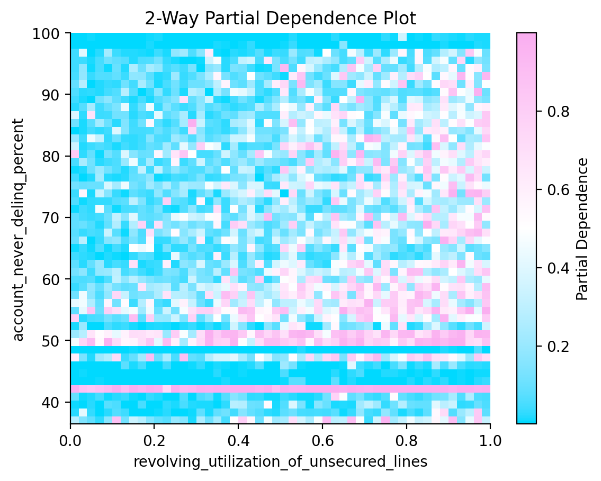
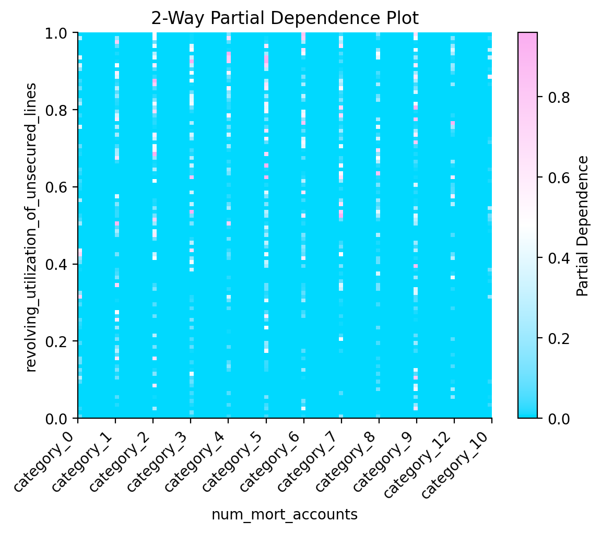
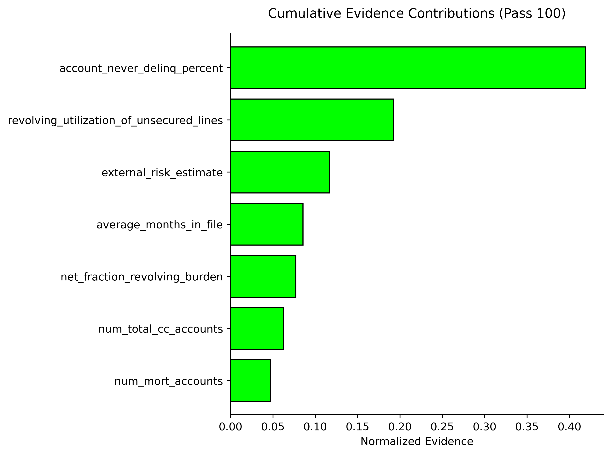
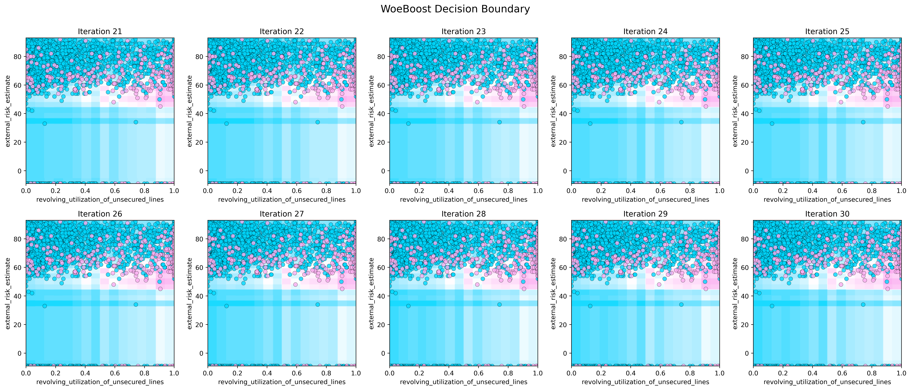

# 🔍 `explainer.py`

The `explainer.py` module provides tools to interpret and visualize models built using the **WoeBoostClassifier** framework. It aids in understanding the behavior and contribution of features, supports visual diagnostics, and enhances the interpretability of decision-making models.

> The module includes functionality for **Partial Dependence Plots (PDP)**, **evidence contribution analysis**, and **Weight of Evidence (WOE) inference**, ensuring that users can effectively explain and visualize model outputs.

---

## **Key Features**

### 1. **Partial Dependence Plot (PDP) Analysis**
   - Visualize the relationship between a feature (or pair of features) and model predictions.
   - Supports both numerical and categorical features.
   - Offers single and two-dimensional PDP visualization.

### 2. **Evidence Contribution Analysis**
   - Quantifies and visualizes feature contributions across boosting iterations.
   - Provides insights into cumulative or per-iteration contributions of individual features.

### 3. **Decision Boundary Visualization**
   - Experimental feature for visualizing decision boundaries across boosting iterations.
   - Supports both numerical and categorical features for customizable visualization.

### 4. **WOE Inference**
   - Derives and applies WOE transformations to input data.
   - Predicts probabilities based on WOE-transformed features.

> Different levels of verbosity can be set in accordance with Python's `logging` module (default is `logging.WARNING`).

---

## **Classes**

### **`PDPAnalyzer`**

#### **Purpose:**
Facilitates the calculation and visualization of **Partial Dependence Plots (PDP)**.

#### **Constructor Parameters**

| Parameter     | Type         | Default         | Description                                      |
|---------------|--------------|-----------------|--------------------------------------------------|
| `model`       | `object`     | Required        | Trained `WoeBoostClassifier` model.             |
| `df`          | `pd.DataFrame` | Required      | DataFrame containing the features to analyze.   |
| `verbosity`   | `int`        | `logging.WARNING` | Logging level (`DEBUG`, `INFO`, etc.).          |

#### **Methods**

- **`calculate_pdp(feature, fixed_features=None, num_points=100)`**  
  Computes PDP values for a single feature.  
  **Returns:**  
  Tuple containing feature range, PDP values, and confidence intervals.

- **`plot_pdp(feature, fixed_features=None, num_points=100, ax=None, title=None)`**  
  Generates a PDP plot for a given feature.

- **`calculate_2way_pdp(feature1, feature2, num_points=50)`**  
  Computes 2-way PDP for two features.  
  **Returns:**  
  Feature grids and PDP values.

- **`plot_2way_pdp(feature1, feature2, plot_type="contourf", cmap="viridis", title=None, ax=None)`**  
  Plots 2-way PDP for two features.

---

### **`EvidenceAnalyzer`**

#### **Purpose:**
Analyzes and visualizes feature contributions in **WoeBoostClassifier** models.

#### **Constructor Parameters**

| Parameter     | Type         | Default         | Description                                      |
|---------------|--------------|-----------------|--------------------------------------------------|
| `model`       | `object`     | Required        | Trained `WoeBoostClassifier` model.             |
| `df`          | `pd.DataFrame` | Required      | DataFrame containing the features to analyze.   |
| `verbosity`   | `int`        | `logging.WARNING` | Logging level (`DEBUG`, `INFO`, etc.).          |

#### **Methods**

- **`calculate_contributions(mode="cumulative")`**  
  Calculates feature contributions over iterations.  
  **Returns:**  
  List of per-iteration or cumulative contributions.

- **`plot_contributions(contributions_per_pass, mode="cumulative", iteration=None)`**  
  Visualizes feature contributions in cumulative or per-iteration mode.

- **`plot_decision_boundary(feature1, feature2, X, y, iteration_range=None, grid_size=(5, 5), cmap="colorcet:cet_d10", output_file=None)`**  
  Experimental feature for plotting decision boundaries over iterations.

---

### **`WoeInferenceMaker`**

#### **Purpose:**
Applies WOE transformations and predicts probabilities using pre-trained WoeBoost models.

#### **Constructor Parameters**

| Parameter     | Type         | Default         | Description                                      |
|---------------|--------------|-----------------|--------------------------------------------------|
| `model`       | `object`     | Required        | Trained `WoeBoostClassifier` model.             |
| `verbosity`   | `int`        | `logging.WARNING` | Logging level (`DEBUG`, `INFO`, etc.).          |

#### **Methods**

- **`generate_bin_report(feature_name, X, y)`**  
  Generates detailed binning reports for features.

- **`infer_woe_score(feature_name, X)`**  
  Infers WOE scores for a specific feature.

- **`transform(X)`**  
  Applies WOE transformations to all features.

- **`predict_proba(X)`**  
  Predicts probabilities based on WOE-transformed features.

---

## **Code Examples**

### Example: PDP Analysis

```python
from explainer import PDPAnalyzer

# Initialize the analyzer
pdp_analyzer = PDPAnalyzer(model=woe_boost_model, df=X_train)

# Calculate and plot PDP for a feature
pdp_analyzer.plot_pdp("revolving_utilization_of_unsecured_lines")
```
**Example for numerical features:**



**Example for categorical features:**



#### Example: 2-Way PDP Analysis

```python
from explainer import PDPAnalyzer

# Initialize the analyzer
pdp_analyzer = PDPAnalyzer(model=woe_boost_model, df=X_train)

# Calculate and plot 2-way PDP
pdp_analyzer.plot_2way_pdp("revolving_utilization_of_unsecured_lines", "account_never_delinquent")
```
**Example for numerical features:**



**Example for categorical features:**



### Example: Evidence Contributions

```python
from explainer import EvidenceAnalyzer

# Initialize the analyzer
evidence_analyzer = EvidenceAnalyzer(model=woe_boost_model, df=X_train)

# Calculate contributions
contributions = evidence_analyzer.calculate_contributions()

# Plot cumulative contributions
evidence_analyzer.plot_contributions(contributions, mode="cumulative")
```



### Example: Decision Boundary Visualization

```python
from explainer import EvidenceAnalyzer
visualizer = EvidenceAnalyzer(woe_boosting_model, X_train)

# Visualize decision boundaries
visualizer.plot_decision_boundary(
    feature1="revolving_utilization_of_unsecured_lines",
    feature2="external_risk_estimate",
    X=X_train,
    y=y_train,
    iteration_range=(20, 30),
    grid_size=(5, 5),
)
```



### Example: WOE Inference

```python
from explainer import WoeInferenceMaker

# Initialize inference maker
woe_inference = WoeInferenceMaker(model=woe_boost_model)

# Transform features to WOE scores
X_woe = woe_inference.transform(X_test)

# Predict probabilities
proba = woe_inference.predict_proba(X_test)
```

## Related Modules
- [`learner.py`](./learner.md): Base learner used for training individual estimators.
- [`classifier.py`](./classifier.md): Boosted classifier orchestrating the training of base learners.


## References
For an overview of modules, check [the Technical Note](./technical_note.md).

## License

This project is licensed under the MIT License - see the [LICENSE](../LICENSE.md) file for details.